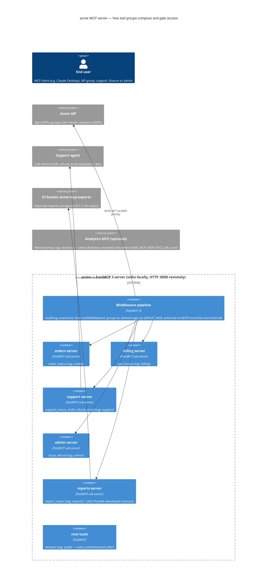
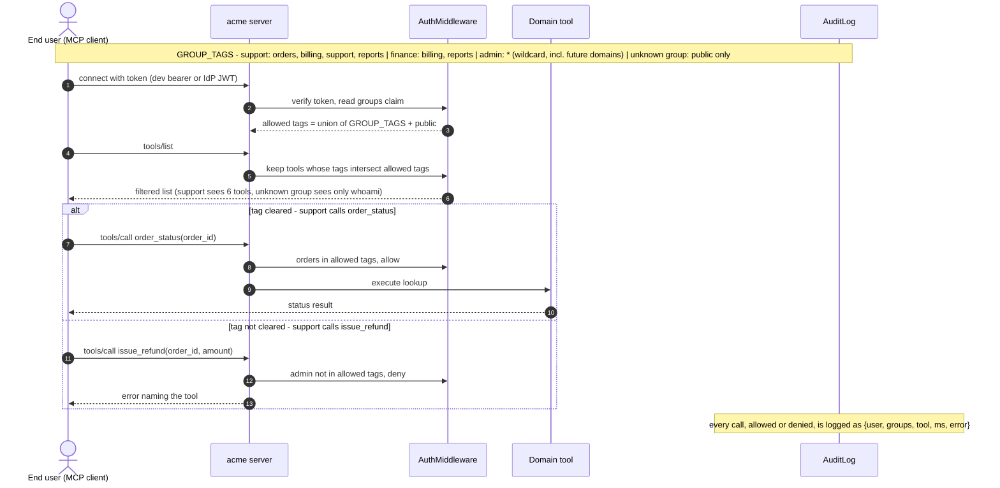

# acme-mcp

A worked example of a **secure [FastMCP](https://gofastmcp.com) 3 server**: JWT
auth, per-group tool access, audit logging, multi-domain composition, and file
delivery via S3 signed URLs. Companion to the post *"Building and securing MCP
servers with FastMCP"*.

This is the "wired up and runnable" version of the snippets in that post, so you
can see how the pieces fit instead of stitching them together yourself.

## What's in here

| Concern | Where | What it shows |
| --- | --- | --- |
| Auth | `src/acme_mcp/auth.py` + `docs/auth-and-access.md` | `JWTVerifier` in prod, `StaticTokenVerifier` for local dev; the group → tag map |
| Per-group access | `src/acme_mcp/access.py` + `docs/auth-and-access.md` | FastMCP `AuthMiddleware`: hides components **and** blocks direct use |
| Audit trail | `src/acme_mcp/audit.py` | `AuditLog` middleware logging user / groups / tool / timing on every call |
| Deterministic domains | `src/acme_mcp/domains/{orders,billing,admin}.py` | plain typed tools over a data backend |
| Agent behind a tool | `src/acme_mcp/domains/support.py` + `agents.py` | an injectable, mockable inner agent on a tight leash |
| File delivery | `src/acme_mcp/domains/reports.py` + `storage.py` | upload to S3, return a short-lived signed URL — never the bytes |
| Composition | `src/acme_mcp/server.py` | mount in-process domains; proxy a separately-owned one |
| Companion skill | `src/acme_mcp/skills/handle-downloads/SKILL.md` | a reports-scoped skill published by the MCP server |
| Tool grouping | `src/acme_mcp/grouping.py` + `docs/tool-grouping.md` | facades front a category; members drop out of `tools/list` but stay callable |

## Install

```bash
pip install -e ".[dev]"
```

## Run

Local (stdio) — a convenience for a single user, e.g. wired into an editor:

```bash
python -m acme_mcp.server
```

Remote (HTTP) — production infrastructure: reachable, multi-user, authenticated:

```bash
ACME_MCP_REMOTE=1 ACME_MCP_ENV=prod python -m acme_mcp.server
```

### Configuration

| Env var | Default | Purpose |
| --- | --- | --- |
| `ACME_MCP_ENV` | `dev` | `dev` uses static dev tokens; anything else uses JWT verification |
| `ACME_MCP_REMOTE` | unset | when set, serve over HTTP instead of stdio |
| `ACME_MCP_HOST` / `ACME_MCP_PORT` | `0.0.0.0` / `8000` | HTTP bind address |
| `ACME_MCP_JWKS_URI` / `ACME_MCP_ISSUER` / `ACME_MCP_AUDIENCE` | acme defaults | JWT verifier settings (prod) |
| `ACME_MCP_ANALYTICS_URL` | unset | when set, proxy a remote analytics MCP service and mount it |

In `dev`, `export_report` is backed by an in-process fake S3 (moto, from the
`dev` extra) so the whole example runs without AWS credentials; in `prod` it
uses the real boto3 client and expects the export bucket to exist.

In `dev`, the `StaticTokenVerifier` accepts these bearer tokens, each mapped to a
group: `dev-support`, `dev-finance`, `dev-admin` (see `auth.py`). A `support`
caller sees orders/billing/support/reports tools; `finance` sees billing/reports;
`admin` sees everything.

## How access control works

Every request is authenticated, then two middleware run:

1. `AuditLog` records who called what.
2. FastMCP's `AuthMiddleware` hides components the caller isn't cleared for and
   blocks direct use, so guessing a hidden tool or resource still fails.

A third middleware, `HideFacadeMembers`, then trims the listing only: tools a
visible `perform_<category>` facade already indexes are dropped from
`tools/list` but remain callable by name. That is a context-budget measure, not
an access control one - see `docs/tool-grouping.md`.

The structure behind that: one server, five mounted domain sub-servers, and the
middleware pipeline every request passes through:



Tools are tagged by domain (`orders`, `billing`, `admin`, `support`, `reports`);
`GROUP_TAGS` in `auth.py` maps each org group to the tags it may use. The
identity tool `whoami` is tagged `public` so any authenticated caller can see it.
The `handle-downloads` skill is tagged `reports`, so the same groups that can
export a report can discover and read its handling instructions through
`skill://handle-downloads/SKILL.md`.
The `admin` group is cleared for the wildcard tag (`ALL_TAGS`) rather than an
explicit domain list, so it stays a true superset — including a later-composed
domain such as the proxied `analytics` service — without anyone having to edit
its tag list each time a domain is added.

And what a caller actually experiences, per request — listing, an allowed call,
and a denied one:



The companion skill lives in the server package and is exposed with FastMCP's
`SkillProvider`. The client reads it as an MCP resource when it needs the
instructions; the server remains responsible for authenticating and authorizing
that read.

## Test

The whole example is covered with TDD and mocks — no real AWS, IdP, or network:

```bash
python -m pytest -q
```

Tests use FastMCP's in-memory `Client`, simulate authenticated callers by setting
the auth context to a token with specific claims (`tests/conftest.py`), mock S3
with `moto`, and inject a fake inner agent for the agent-backed tool.
