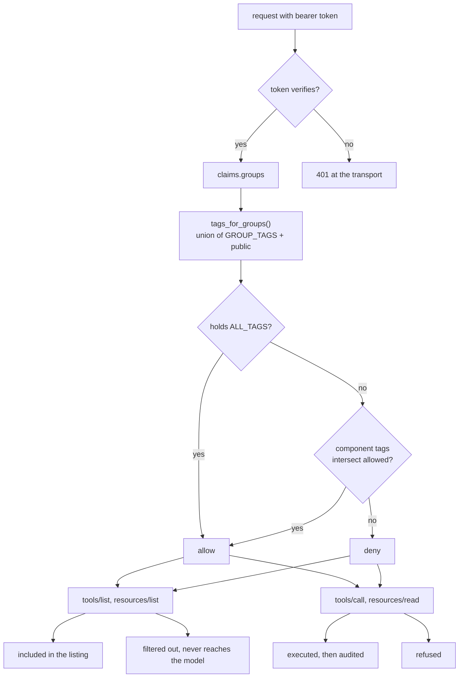

# Auth And Access Control

Two questions get answered on every request, and keeping them apart is most of
the design. Authentication asks who is calling, and the answer comes from a
verified token. Authorization asks what that caller may touch, and the answer
comes from mapping the token's groups to tool tags.

Everything below is one check, `group_access` in `access.py`, enforced at two
points: when components are listed, and when they are used. A tool the caller
cannot use never appears in their listing, and guessing its name does not help.

## Who Is Calling

`build_auth` returns a verifier chosen by environment. In production that is a
`JWTVerifier` pointed at the company IdP's published keys, checking signature,
issuer and audience. In dev it is a `StaticTokenVerifier` seeded with three
fixed bearer tokens so you can curl the server without an IdP.

The dev tokens are the moral equivalent of a hardcoded password. They exist so
the example runs offline and should never reach anything real.

Once verified, the token's claims carry a `groups` list. That list is the only
input to every access decision that follows.

## Groups Become Tags

Tools are tagged by domain at registration. `GROUP_TAGS` maps each org group to
the tags it may use, and `tags_for_groups` resolves a claim into that set.

```python
GROUP_TAGS = {
    "support": {"orders", "billing", "support", "reports", "maths", "english"},
    "finance": {"billing", "reports", "maths", "english"},
    "admin": {ALL_TAGS},
}
```

Two details in there earn their keep.

`admin` holds the wildcard rather than a list of every domain. Spelling the
domains out means admin silently stops being a superset the moment someone
mounts a new one, and nobody notices because nothing fails. The wildcard makes
"admin sees everything" true by construction instead of by maintenance.

`PUBLIC_TAGS` is unioned into every result, so `whoami` is reachable by any
authenticated caller regardless of group. An unknown group is not an error, it
just lands on `public` and nothing else.

### Claims Are Untrusted Input

An IdP's `groups` claim is not as tidy as the happy path assumes, and it drives
an access decision, so `_normalize_groups` handles the awkward shapes
explicitly. Every path fails closed: bad input can only cost a caller tags,
never grant them.

| `groups` claim | Result | Why it is handled |
| --- | --- | --- |
| missing | `{public}` | ordinary case |
| `null` | `{public}` | `dict.get(..., [])` does not cover an explicit null, so iterating would raise |
| `"admin"` | `{*, public}` | some IdPs emit a single group unquoted; iterating the string would loop over characters, match nothing, and lock the user out |
| `["admin", 7]` | `{*, public}` | non-string entries dropped, valid ones kept |
| `42`, `{"a": 1}` | `{public}` | unexpected type, no groups |

That table is generated from behaviour, not intent. `tests/test_auth.py`
covers each row.

## One Check, Two Enforcement Points

```python
def group_access(ctx: AuthContext) -> bool:
    if ctx.token is None:
        return False
    allowed = tags_for_groups(ctx.token.claims.get("groups"))
    if ALL_TAGS in allowed:
        return True
    component_tags = set(ctx.component.tags)
    if skill_info := getattr(ctx.component, "skill_info", None):
        component_tags.update(skill_info.frontmatter.get("tags", []))
    return bool(component_tags & allowed)
```

FastMCP's `AuthMiddleware` runs that function on both paths, which is what
makes the two properties hold together:

- **Listing.** Denied components are filtered out of `tools/list`,
  `resources/list` and `prompts/list`, so they never reach the model's context.
- **Use.** `tools/call` and `resources/read` run the same check, so a caller
  who guesses a name they never saw is still refused.

The unauthenticated branch is deliberate. `ctx.token is None` denies
everything, which is what empties the listing before an auth provider rejects
the request outright.

Skills need the extra `skill_info` lookup because FastMCP 3.4 keeps skill
frontmatter as metadata rather than projecting it onto component tags. Without
it a `reports`-tagged skill would be invisible to the check and would leak.
It carries a `ponytail:` marker to be deleted when the provider projects tags.



Audit sits outside all of it. `AuditLog` is registered first so it wraps the
outermost call, which means a denied attempt is recorded too:

```
AUDIT tool=issue_refund user=user@acme.test groups=['engineering']
      error=AuthorizationError
```

A refusal nobody logged is a refusal nobody can investigate.

## What A Caller Sees

Measured, not asserted:

| Groups claim | Tools listed | Resources listed |
| --- | --- | --- |
| unauthenticated | 0 | 0 |
| `["engineering"]` (no grants) | 1 (`whoami`) | 0 |
| `["finance"]` | 5 | 6 |
| `["support"]` | 8 | 6 |
| `["admin"]` | 9 | 6 |

Those tool counts are lower than the number of tools each group may *use*,
because the category facades hide their members from the listing. That is a
separate concern with its own document, `tool-grouping.md`; the access check is
unchanged by it and runs first.

## The Part That Does Not Hold: Name Enumeration

Hiding a tool from the listing is not the same as pretending it does not exist,
and here the two come apart.

FastMCP's built-in returns different text for the two failure modes:

```
tools/call issue_refund          (exists, caller not cleared)
  -> Authorization failed for tool 'issue_refund': insufficient permissions

tools/call definitely_not_a_tool  (does not exist)
  -> Authorization failed for tool 'definitely_not_a_tool': not found or not authorized
```

So a caller who cannot see `issue_refund` can still confirm it exists by
calling it and reading which sentence comes back. Resources behave the same
way. It leaks names and their existence, not data or behaviour, but it is
enough to map the server's full surface from an account with no grants.

This is a known, deliberate trade: `test_denied_call_names_the_tool` pins it,
and its docstring explains the reasoning. Using FastMCP's built-in
`AuthMiddleware` is less code than a hand-rolled one that normalised both
errors, and the leak is names rather than data.

Two things are worth flagging anyway. It got cheaper to exploit when facade
members left the listing, because there are simply more hidden names to
confirm. And `openspec/specs/access-control/spec.md` still says the rejection
SHALL read `Unknown tool: <name>` in every failure mode, written when a
hand-rolled `GroupTagFilter` did exactly that. The refactor to the built-in
dropped the property and the spec never caught up, so today the code and the
spec disagree about whether this is acceptable.

The fix is a thin middleware over `on_call_tool` and `on_read_resource`
normalising both cases to one message. Whether to add it or amend the spec is a
decision for whoever owns the threat model, not something to settle in a docs
change.

## Adding A Domain Or A Group

Tagging is the whole interface, so neither needs code changes to `access.py`.

```python
# a new domain: tag it, and every existing grant keeps working
@reports_server.tool(tags={"reports"})
def export_report(...): ...

# a new group: name the tags it may use
GROUP_TAGS["engineering"] = {"orders", "reports"}
```

`admin` picks up the new domain automatically through the wildcard. Every other
group ignores it until someone grants the tag, which is the right default: a
new domain is invisible until a human says who may see it.

## Proving It

```bash
python -m pytest -q
```

`tests/test_auth.py` and `tests/test_access.py` carry the load:

| Test | What it locks down |
| --- | --- |
| `test_normalize_groups_fails_closed_on_odd_types`, `test_null_groups_claim_does_not_crash`, `test_scalar_string_groups_claim_is_treated_as_one_group` | the untrusted-input table above, all failing closed |
| `test_support_sees_only_their_tools`, `test_finance_sees_only_billing`, `test_admin_sees_everything` | the listing filter, per group |
| `test_unauthenticated_caller_sees_nothing` | no token, no listing |
| `test_guessed_hidden_tool_name_is_blocked` | a name the caller never saw is still refused |
| `test_denied_call_names_the_tool` | the enumeration oracle below, pinned as current behaviour |
| `test_cleared_callers_can_discover_and_read_skills`, `test_unknown_group_cannot_discover_or_read_skills` | skills follow the same rule as tools |
| `test_blocked_call_is_still_audited` | a denied attempt lands in the audit log as `AuthorizationError` |

To watch the mapping by hand:

```python
from acme_mcp.auth import tags_for_groups

for claim in (None, [], "admin", ["support", "finance"], 42):
    print(f"{str(claim):22} -> {sorted(tags_for_groups(claim))}")
```

```
None                   -> ['public']
[]                     -> ['public']
admin                  -> ['*', 'public']
['support', 'finance'] -> ['billing', 'english', 'maths', 'orders', 'public', 'reports', 'support']
42                     -> ['public']
```
