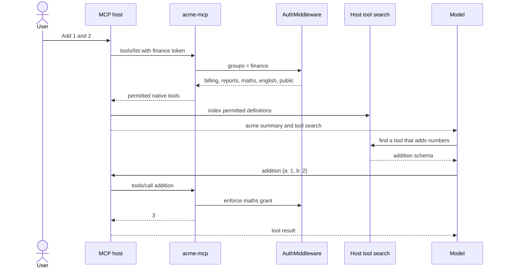

# Tag filtering and tool search

## Summary

Large MCP servers can spend a meaningful part of the model context on tool
definitions. This server reduces that catalogue in two stages:

1. The server maps the caller's identity groups to domain tags and removes
   tools and resources the caller cannot use.
2. A tool-search capable host defers the remaining native tool definitions and
   loads the small set needed for the current request.

The first stage is access control. The second stage is where context use falls.
Keeping the stages separate leaves every permitted tool available under its
real name with its typed input schema.

Clients without tool search receive the complete permitted catalogue from
`tools/list`. For this example that is at most 15 tools. The same approach also
works for a much larger server, where deferred loading saves more context.

## Example

A finance token contains this claim:

```json
{"sub": "finance@acme.dev", "groups": ["finance"]}
```

`GROUP_TAGS` grants that caller the `billing`, `reports`, `maths`, and
`english` domains. The public tag is added for every authenticated caller. The
server therefore returns these native tools:

```text
whoami
get_invoice
export_report
addition
subtraction
multiplication
division
vowel_count
noun_count
verb_count
word_count
```

Each definition keeps its own schema. The `addition` entry includes two typed
arguments:

```json
{
  "name": "addition",
  "description": "Add two numbers.",
  "inputSchema": {
    "type": "object",
    "properties": {
      "a": {"anyOf": [{"type": "integer"}, {"type": "number"}]},
      "b": {"anyOf": [{"type": "integer"}, {"type": "number"}]}
    },
    "required": ["a", "b"]
  }
}
```

A host with deferred tool search can initially expose only the `acme` server
description and its search tool to the model. When the user asks for a sum, the
host loads `addition` and calls it directly:

```json
{"name": "addition", "arguments": {"a": 1, "b": 2}}
```

The result is `3`. Authorization runs again on the call, so a caller without
the `maths` grant cannot use the tool even if they guess its name.



## Technical detail

### Tags define server-side domains

Each tool carries the tag for its domain:

```python
@maths_server.tool(tags={"maths"})
def addition(a: int | float, b: int | float) -> int | float:
    """Add two numbers."""
    return a + b
```

`GROUP_TAGS` maps identity groups to those domain tags:

```python
GROUP_TAGS = {
    "support": {"orders", "billing", "support", "reports", "maths", "english"},
    "finance": {"billing", "reports", "maths", "english"},
    "admin": {ALL_TAGS},
}
```

FastMCP's `AuthMiddleware` uses the same access function for discovery and
execution. Unauthorized tools disappear from `tools/list`, and direct calls to
their names fail authorization.

Tags group tools effectively inside this server because one grant controls a
whole domain. They also let a new tagged tool inherit the existing access rule
without adding its name to a second allowlist.

### Tool search works on the permitted catalogue

The providers document search over tool names, descriptions, argument names,
and argument descriptions. FastMCP tags remain server metadata and are not a
documented provider search input.

This gives each piece one responsibility:

| Stage | Input | Output | Purpose |
| --- | --- | --- | --- |
| Server access filter | Verified groups and component tags | Permitted tools and resources | Prevent discovery and use of unauthorized domains |
| Host tool search | Permitted native tool metadata | A small set of loaded tool definitions | Reduce model context and focus selection |

Clear names and descriptions still matter. A phrase such as "add two numbers"
can match `addition`; the `maths` tag decides whether that definition enters the
searchable catalogue in the first place.

The current server listings are:

| Group | Native tools listed |
| --- | ---: |
| `engineering` | 1 |
| `finance` | 11 |
| `support` | 14 |
| `admin` | 15 |

These counts describe server discovery. The number of definitions placed in
the model context depends on the host and its deferred-loading configuration.

### OpenAI configuration

OpenAI's [tool search guide](https://developers.openai.com/api/docs/guides/tools-tool-search)
requires a `tool_search` entry and `defer_loading: true` on the MCP server tool.
The model initially receives the server label and description, then loads
individual tools when needed.

This is the relevant part of a Responses API request:

```json
{
  "tools": [
    {
      "type": "mcp",
      "server_label": "acme",
      "server_description": "Order, billing, support, reporting, maths and English tools. Access is filtered by the caller's groups.",
      "server_url": "https://mcp.acme.example/mcp",
      "authorization": "<caller access token>",
      "defer_loading": true
    },
    {"type": "tool_search"}
  ]
}
```

The `authorization` value must carry the caller identity used by this server's
group-to-tag check. OpenAI documents the full remote-server fields in its
[MCP guide](https://developers.openai.com/api/docs/guides/tools-connectors-mcp).

### Claude configuration

Claude's [tool search guide](https://platform.claude.com/docs/en/agents-and-tools/tool-use/tool-search-tool)
offers regex and BM25 variants. BM25 accepts natural-language searches. With
the MCP connector, deferred loading is configured on the `mcp_toolset` entry:

```json
{
  "mcp_servers": [
    {
      "type": "url",
      "url": "https://mcp.acme.example/mcp",
      "name": "acme",
      "authorization_token": "<caller access token>"
    }
  ],
  "tools": [
    {
      "type": "tool_search_tool_bm25_20251119",
      "name": "tool_search_tool_bm25"
    },
    {
      "type": "mcp_toolset",
      "mcp_server_name": "acme",
      "default_config": {
        "enabled": true,
        "defer_loading": true
      }
    }
  ]
}
```

The current MCP connector also requires the `mcp-client-2025-11-20` beta. See
Anthropic's [MCP connector guide](https://platform.claude.com/docs/en/agents-and-tools/mcp-connector)
for the complete request.

### Companion skills use the same tags

Skills are MCP resources rather than tools. Their frontmatter carries the same
domain tag as the tools they explain:

```yaml
---
name: calculator-usage
tags: ["maths"]
---
```

The access middleware combines resource tags with skill frontmatter tags. A
caller granted `maths` can list and read
`skill://calculator-usage/SKILL.md`; other callers cannot. The `reports` and
`english` skills follow the same rule.

Provider tool search covers tool definitions. A host that uses companion
skills must list or retrieve MCP resources through its own resource flow. The
shared tag keeps tool and skill access aligned even though discovery is
separate.

### Hosts without tool search

A client without deferred search receives every permitted native schema. This
is often reasonable for a small catalogue.

For a large catalogue on a host that cannot defer definitions, a category
facade remains an available server-side pattern. One broad tool can list and
dispatch domain operations. Its costs are an extra discovery call, dictionary
arguments at the facade boundary, custom dispatch code, and loss of native
member calls from the host's catalogue. Use it only when those costs are lower
than sending all permitted schemas.

### Adding a domain

Add the domain tag to its tools and companion skills, then grant the tag in
`GROUP_TAGS`:

```python
@reports_server.tool(tags={"reports"})
def export_report(...): ...

GROUP_TAGS["engineering"] = {"orders", "reports"}
```

No search-specific server code is required. Review tool names, descriptions,
and argument descriptions because those fields drive provider search.

### Verification

Run the focused discovery tests with the project virtual environment:

```bash
.venv/bin/python -m pytest -q tests/test_tool_discovery.py tests/test_maths.py tests/test_english.py
```

The tests check native discovery, typed schemas, tag-scoped skills, direct
calls, and denial outside the caller's grants. Run the complete suite before
changing server composition or access middleware:

```bash
.venv/bin/python -m pytest -q
```
