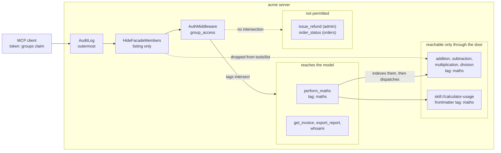
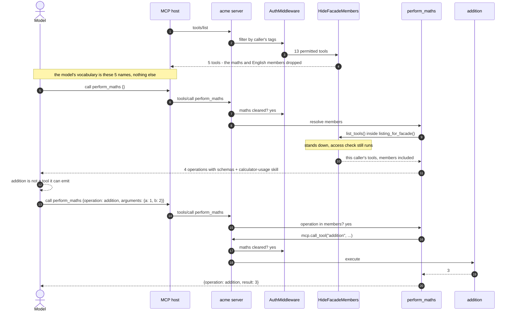

# Tool Grouping And Surfacing

A caller's tool list is context. Every tool the server lists gets read by the
model on every turn, whether or not it is relevant. An admin on this server
sees 17 tools; four of them are arithmetic. Dumping the lot into a listing is
how you end up paying for `subtraction`'s input schema in a conversation about
refunds.

So the server surfaces tools in three layers. Tags decide what a caller may
reach at all. A category facade drops its members from `tools/list`, so the
model reads one line for "maths" instead of four tools with full schemas. And
that facade is a door in both directions: call it bare to get the category's
index, call it with an `operation` to run one of the tools in it.

The dispatch half is not a convenience, and it is the part worth understanding
before you copy any of this. A host hands the model exactly the tool
definitions that came back from `tools/list`. A tool missing from that listing
is not in the model's vocabulary, so the model can never emit a call for it, no
matter what the server would have permitted. Publishing a schema inside a
result does not change that: the schema is result data, not a tool definition.
Hide a tool without giving it a route and you have not saved context, you have
deleted the tool.

## Layer One: Tags Decide What Exists

Every tool carries a domain tag at registration:

```python
@maths_server.tool(tags={"maths"})
def addition(a: int | float, b: int | float) -> int | float:
    """Add two numbers."""
    return a + b
```

`GROUP_TAGS` in `auth.py` maps each org group to the tags it may use, and
`group_access` in `access.py` intersects the caller's tags with the
component's:

```python
def group_access(ctx: AuthContext) -> bool:
    if ctx.token is None:
        return False
    allowed = tags_for_groups(ctx.token.claims.get("groups"))
    if ALL_TAGS in allowed:
        return True
    ...
    return bool(component_tags & allowed)
```

FastMCP's `AuthMiddleware` runs that check in both directions. It filters
denied components out of `tools/list`, and it blocks `tools/call` on a name the
caller guessed. Skills go through the same check, matched on their frontmatter
tags, so the same groups that can export a report can read the report handling
instructions.



Two filters run on a listing, in an order that matters. `AuthMiddleware`
decides what the caller may reach. `HideFacadeMembers` then looks at what
survived and drops anything a visible facade already fronts. That ordering is
why hiding can never strand a tool: it only ever hides behind a door the caller
can actually see, and that door can run what it hid.

## Layer Two: A Facade Per Category

`_facade` in `server.py` registers one tool per category, and it resolves its
members at call time from the server's own listings rather than a hardcoded
table:

```python
with listing_for_facade():
    listed = await mcp.list_tools()
members = {t.name: t for t in listed if tag in t.tags and t.name != name}
```

That dict is the whole mechanism, and both jobs read from it. `mcp.list_tools()`
runs under the caller's auth context, so it arrives already filtered by layer
one. The tag comparison narrows it to the category, and the name check keeps
the facade out of its own answer.

Building from the live listing is what keeps the facade honest. Add a fifth
maths tool and the facade reports it on the next call, with no second place to
update and no chance of advertising something the caller cannot run. A static
list would drift, and a drifted facade is worse than none because a model
trusts it.

The response shape is `category`, `description`, `tools`, `skills`:

```json
{
  "category": "maths",
  "description": "List the available maths operations and companion skills.",
  "tools": [
    {
      "name": "addition",
      "description": "Add two numbers.",
      "input_schema": {"type": "object", "properties": {"a": {...}, "b": {...}},
                       "required": ["a", "b"]}
    }
  ],
  "skills": [
    {"name": "calculator-usage",
     "description": "...",
     "uri": "skill://calculator-usage/SKILL.md"}
  ]
}
```

Input schemas are included deliberately. A model that has read that index has
everything it needs to build a correct `addition` call on the next turn,
without a round trip to look the signature up.

Skills are filtered the same way, minus the `_manifest` resources, which are
plumbing the model has no use for.

### Running A Member

Pass an `operation` and the same tool dispatches instead of indexing:

```python
if operation is not None:
    if operation not in members:
        raise ToolError(f"Unknown {tag} operation: {operation}")
    result = await mcp.call_tool(operation, arguments or {})
```

`mcp.call_tool` runs the full middleware chain, so a dispatched call is
access-checked and audited exactly like a direct one. Nothing is smuggled past
the pipeline by going through the door.

The `operation not in members` guard is what stops the facade becoming a
confused deputy. `members` is the caller's own filtered listing, so an unknown
name, another domain's tool, and one the caller is not cleared for all fail the
same way, with the same message. There is no oracle in the difference.

```json
{"category": "maths", "operation": "addition", "result": 3}
```

## The Discovery Path



Two things that diagram is drawn to make obvious. The model talks to the host,
not the server, and it can only name the five tools the host was given, which
is why step 8 is a dead end rather than a shortcut. And the dispatched call at
step 12 re-enters the same pipeline, so it is access-checked and audited like
any other.

The facade never gets a privileged view. Standing hiding down does not stand
the access check down, so it still sees exactly what the caller may reach, and
still cannot name or run a tool the caller would be denied.

## What A Caller Actually Sees

`HideFacadeMembers` in `grouping.py` overrides `on_list_tools` and nothing
else:

```python
tools = await call_next(context)
if _listing_for_facade.get():
    return tools
doors = {tool.name for tool in tools} & set(self.facades.values())
hidden = {tag for tag, name in self.facades.items() if name in doors}
return [t for t in tools if t.name in doors or not (hidden & set(t.tags))]
```

There is no `on_call_tool`, which is the whole design. Hiding is a listing
concern; permission is decided elsewhere and did not change.

The effect on the listing:

| Group | Before | After | What is left |
| --- | --- | --- | --- |
| `engineering` (no grants) | 1 | 1 | `whoami` |
| `finance` | 13 | 5 | 2 facades, `get_invoice`, `export_report`, `whoami` |
| `support` | 16 | 8 | as above plus orders and support tools |
| `admin` | 17 | 9 | as above plus `issue_refund` |

Eight tools and their schemas leave a finance caller's context, replaced by two
lines. The saving scales with domain size, which is the argument for doing this
before a domain gets large rather than after.

### The Facade Has To Opt Out Of Its Own Hiding

`_facade` builds its answer from `mcp.list_tools()`, and that call runs the
full middleware pipeline. Once hiding is in the pipeline, the facade hides its
own members from itself and returns an empty list.

The tempting fix is `mcp.list_tools(run_middleware=False)`, which FastMCP
offers. Do not use it here. That flag skips *all* middleware, including the
access check, so the facade would happily name tools the caller cannot call.

Instead a context variable asks the hiding middleware to stand down for the
duration of the facade's own listing:

```python
with listing_for_facade():
    listed = await mcp.list_tools()
```

Everything else in the pipeline still runs, so the access check still applies
and the facade stays scoped to the caller. One flag, one place, and the
authorization path is never duplicated.

### Why This Needs Dispatch, Not Just Hiding

The first version of this change hid the members and stopped there, on the
reasoning that a hidden tool is still a permitted tool, so a name from the
facade would work on the next turn. That is true of the *server* and false of
the *system*, and the difference is the whole thing.

The server will happily execute `tools/call addition` from a caller cleared for
`maths`, listed or not. But the model never gets to ask. The host builds the
model's toolset from `tools/list`, and `addition` is not in it, so there is no
call for the server to receive. The tests passed anyway, because
`Client.call_tool("addition", ...)` dispatches a name directly and never
consults a toolset at all. They were testing the server's willingness, not the
model's reach.

Worth repeating as a rule, because it is easy to get wrong twice: **a schema in
a result is not a tool definition.** If you take a tool out of `tools/list`, you
owe it a route back in.

Two routes exist. This server dispatches through the facade, which needs
nothing from the host. The other is dynamic listing: unlock the members on
first use and send `notifications/tools/list_changed` so the host re-lists.
That keeps real tool definitions and per-tool schema validation, at the cost of
session state and a host that honours the notification. FastMCP 3.4 has no
server-side helper for it, so dispatch was the cheaper correct answer here.

### What Dispatch Costs

Arguments arrive as an untyped `dict`, so the host has no schema to check them
against before the call goes out. Validation still happens, one hop later:
`mcp.call_tool` runs the member's own signature checks, and the error names the
member rather than the door.

```
perform_maths {"operation": "division", "arguments": {"a": 1}}
  -> 1 validation error for call[division]
     b  Missing required argument
```

A `ToolError` the member raises propagates unchanged, so `{"a": 1, "b": 0}`
still comes back as `division by zero`. What you lose is the host's chance to
catch a bad call before making it, not the diagnosis afterwards.

The other cost is real but smaller: an unlisted tool gets no client-side output
validation, since the client was never given a schema to check the result
against.

## Adding A Category

Three steps, no framework:

1. Tag the tools in a domain sub-server, for example `tags={"reports"}`.
2. Grant the tag to whichever groups need it in `GROUP_TAGS`.
3. Register the door in `build_server` and add its tag to the `facades` map,
   which is what tells `HideFacadeMembers` which members to drop:

```python
facades = {
    "reports": _facade(
        mcp,
        name="perform_reports",
        tag="reports",
        description="List the available reporting tools and companion skills.",
    ),
}
```

The facade inherits the tag, so it appears and disappears with the domain it
describes. A caller not cleared for `reports` never sees `perform_reports` and
cannot call it by name.

## Proving It

The behaviour above is covered by `tests/test_facades.py`, and the whole suite
runs offline with FastMCP's in-memory client:

```bash
python -m pytest -q
```

```
117 passed in 5.38s
```

The tests that matter for this doc:

| Test | Claim it locks down |
| --- | --- |
| `test_cleared_callers_see_both_facades` | facades are listed for support, finance and admin |
| `test_perform_maths_lists_only_maths_tools` | exactly the four maths tools, each with a usable input schema |
| `test_perform_english_lists_only_english_tools` | the same for English, so neither facade bleeds into the other |
| `test_uncleared_caller_cannot_see_or_call_facades` | an `engineering` caller gets neither the listing nor the call |
| `test_facade_named_tool_is_callable` | a name the facade returns can be run through the facade that named it |
| `test_facade_companion_skill_uri_is_readable` | the returned `skill://` URI resolves to real content |
| `test_facade_contents_are_scoped_to_the_caller` | a caller cleared for one category only sees that category inside the facade |
| `test_a_model_reaches_hidden_members_only_through_the_facade` | the host path: hidden names are outside the model's vocabulary, dispatch is the route |
| `test_facade_refuses_anything_outside_its_own_domain` | unknown, cross-domain and self-reference all fail identically |
| `test_hiding_does_not_grant_access` | an uncleared caller guessing a hidden name is still refused |
| `test_members_stay_listed_when_their_facade_is_not` | no tool is stranded when its door is missing from the listing |

Two are worth reading in full.

`test_a_model_reaches_hidden_members_only_through_the_facade` walks the host
path rather than the one `Client` permits: it builds the set of names that came
back from `tools/list`, asserts the member is not in it, and then runs the
member through the door. An earlier version of this change passed every other
test while being unusable from a real host, because every other test called the
member by name directly. This is the one that would have caught it.

`test_facade_contents_are_scoped_to_the_caller` grants a synthetic group the
`maths` tag and nothing else, then checks the facade's answer against what the
caller can actually run. Without it, every real group holds both `maths` and
`english`, so a facade that ignored auth entirely and filtered on tags alone
would still pass.

`tests/test_maths.py` and `tests/test_english.py` assert the same contract from
the other end: each tool is absent from `tools/list`, present in its facade's
index, runnable through its facade, and still carrying its domain tag.

To see the layering by hand, list tools as each group against the in-memory
client:

```python
import asyncio
from fastmcp import Client
from acme_mcp.server import build_server
from tests.conftest import as_caller

async def main():
    mcp = build_server(env="dev")
    for groups in (["engineering"], ["finance"], ["support"], ["admin"]):
        with as_caller(groups=groups):
            async with Client(mcp) as c:
                print(groups, sorted(t.name for t in await c.list_tools()))

asyncio.run(main())
```

Which prints, at the time of writing:

```
['engineering'] ['whoami']
['finance'] ['export_report', 'get_invoice', 'perform_english', 'perform_maths',
             'whoami']
['support'] ['draft_refund_email', 'export_report', 'get_invoice',
             'order_status', 'perform_english', 'perform_maths',
             'support_macro', 'whoami']
['admin'] ['draft_refund_email', 'export_report', 'get_invoice', 'issue_refund',
           'order_status', 'perform_english', 'perform_maths', 'support_macro',
           'whoami']
```

Not an arithmetic tool in sight, and every one of them still reachable through
its door.

Listing is only half of it though, and the half that misled me once already. To
check the part that actually matters, model what a host does: it offers the
model the names from `tools/list` and will not dispatch anything else.

```python
class Host:
    """Only dispatches a tool it offered the model."""

    def __init__(self, client):
        self.client, self.offered = client, {}

    async def refresh(self):
        self.offered = {t.name: t for t in await self.client.list_tools()}
        return sorted(self.offered)

    async def model_calls(self, name, args):
        if name not in self.offered:
            return f"UNAVAILABLE: {name!r} is not in the model's toolset"
        return (await self.client.call_tool(name, args)).data
```

Driven against a `finance` caller, that prints:

```
model's toolset: ['export_report', 'get_invoice', 'perform_english',
                  'perform_maths', 'whoami']

turn 1, model calls perform_maths:
  facade named: ['addition', 'division', 'multiplication', 'subtraction']

turn 2a, model tries the bare name (the old, broken path):
  UNAVAILABLE: 'addition' is not in the model's toolset

turn 2b, model routes through the door it was offered:
  {'category': 'maths', 'operation': 'addition', 'result': 3}
```

Line 2a is the one to keep in mind. It is what the whole design is arranged to
avoid, and it is invisible to any test that calls a tool by name.
