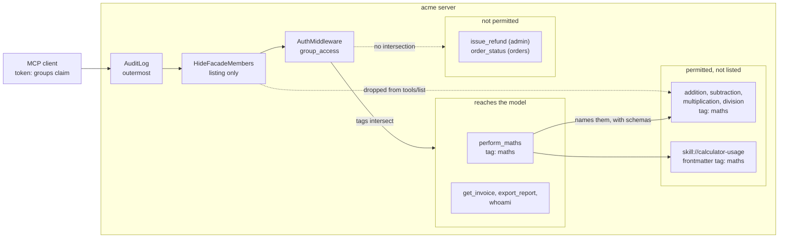
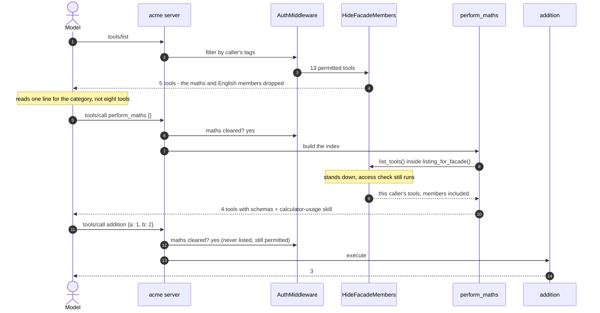

# Tool Grouping And Surfacing

A caller's tool list is context. Every tool the server lists gets read by the
model on every turn, whether or not it is relevant. An admin on this server
sees 17 tools; four of them are arithmetic. Dumping the lot into a listing is
how you end up paying for `subtraction`'s input schema in a conversation about
refunds.

So the server surfaces tools in three layers. Tags decide what a caller may
reach at all. Category facades act as a per-domain index, so a model can ask
"what maths can you do?" and get one answer. And the members a facade fronts
are dropped from the listing, so the model reads one line for the category
instead of four tools with full schemas, and only pulls the detail if the
category is relevant.

Keep two ideas apart, because the rest of this doc leans on the distinction.
Permission is what a caller may call, and it never changes here. Visibility is
what lands in `tools/list`. A hidden tool is still a permitted tool: the facade
hands the model its name and schema, and that name works on the next turn.

## Layer One: Tags Decide What Exists

Every tool carries a domain tag at registration:

```python
@maths_server.tool(tags={"maths"})
def addition(a: int | float, b: int | float) -> int | float:
    """Add two numbers."""
    return a + b
```

`GROUP_TAGS` in `auth.py` maps each org group to the tags it may use, and
`group_access` in `access.py` intersects the caller's tags with the
component's:

```python
def group_access(ctx: AuthContext) -> bool:
    if ctx.token is None:
        return False
    allowed = tags_for_groups(ctx.token.claims.get("groups"))
    if ALL_TAGS in allowed:
        return True
    ...
    return bool(component_tags & allowed)
```

FastMCP's `AuthMiddleware` runs that check in both directions. It filters
denied components out of `tools/list`, and it blocks `tools/call` on a name the
caller guessed. Skills go through the same check, matched on their frontmatter
tags, so the same groups that can export a report can read the report handling
instructions.



Two filters run on a listing, in an order that matters. `AuthMiddleware`
decides what the caller may reach. `HideFacadeMembers` then looks at what
survived and drops anything a visible facade already indexes. That ordering is
why hiding can never strand a tool: it only ever hides behind a door the caller
can actually see.

## Layer Two: A Facade Per Category

`_facade` in `server.py` registers a no-argument tool per category. It builds
its answer at call time from the server's own listings rather than a hardcoded
table:

```python
tools = [
    {"name": t.name, "description": t.description, "input_schema": t.parameters}
    for t in await mcp.list_tools()
    if tag in t.tags and t.name != name
]
```

That comprehension is the whole mechanism. `mcp.list_tools()` runs under the
caller's auth context, so it arrives already filtered by layer one. The tag comparison narrows it
to the category, and the name check keeps the facade out of its own answer.

Building from the live listing is what keeps the facade honest. Add a fifth
maths tool and the facade reports it on the next call, with no second place to
update and no chance of advertising something the caller cannot run. A static
list would drift, and a drifted facade is worse than none because a model
trusts it.

The response shape is `category`, `description`, `tools`, `skills`:

```json
{
  "category": "maths",
  "description": "List the available maths operations and companion skills.",
  "tools": [
    {
      "name": "addition",
      "description": "Add two numbers.",
      "input_schema": {"type": "object", "properties": {"a": {...}, "b": {...}},
                       "required": ["a", "b"]}
    }
  ],
  "skills": [
    {"name": "calculator-usage",
     "description": "...",
     "uri": "skill://calculator-usage/SKILL.md"}
  ]
}
```

Input schemas are included deliberately. A model that calls `perform_maths` has
everything it needs to call `addition` correctly on the very next turn, without
a round trip to look the signature up.

Skills are filtered the same way, minus the `_manifest` resources, which are
plumbing the model has no use for.

## The Discovery Path



The facade never gets a privileged view. Standing hiding down does not stand
the access check down, so it still sees exactly what the caller may reach, and
still cannot name a tool the caller would then be denied.

## What A Caller Actually Sees

`HideFacadeMembers` in `grouping.py` overrides `on_list_tools` and nothing
else:

```python
tools = await call_next(context)
if _listing_for_facade.get():
    return tools
doors = {tool.name for tool in tools} & set(self.facades.values())
hidden = {tag for tag, name in self.facades.items() if name in doors}
return [t for t in tools if t.name in doors or not (hidden & set(t.tags))]
```

There is no `on_call_tool`, which is the whole design. Calls go through the
access check untouched.

The effect on the listing:

| Group | Before | After | What is left |
| --- | --- | --- | --- |
| `engineering` (no grants) | 1 | 1 | `whoami` |
| `finance` | 13 | 5 | 2 facades, `get_invoice`, `export_report`, `whoami` |
| `support` | 16 | 8 | as above plus orders and support tools |
| `admin` | 17 | 9 | as above plus `issue_refund` |

Eight tools and their schemas leave a finance caller's context, replaced by two
lines. The saving scales with domain size, which is the argument for doing this
before a domain gets large rather than after.

### The Facade Has To Opt Out Of Its Own Hiding

`_facade` builds its answer from `mcp.list_tools()`, and that call runs the
full middleware pipeline. Once hiding is in the pipeline, the facade hides its
own members from itself and returns an empty list.

The tempting fix is `mcp.list_tools(run_middleware=False)`, which FastMCP
offers. Do not use it here. That flag skips *all* middleware, including the
access check, so the facade would happily name tools the caller cannot call.

Instead a context variable asks the hiding middleware to stand down for the
duration of the facade's own listing:

```python
with listing_for_facade():
    listed = await mcp.list_tools()
```

Everything else in the pipeline still runs, so the access check still applies
and the facade stays scoped to the caller. One flag, one place, and the
authorization path is never duplicated.

### Two Things To Know Before Copying This

An unlisted tool loses client-side output validation. FastMCP's `Client` warns
`Tool addition not listed by server, cannot validate any structured content`
and hands back the raw result. The call works and the value is correct, but
the client cannot check it against a schema it was never given. If you rely on
that validation, hide fewer tools.

Hidden is not denied. A caller who guesses `addition` and is cleared for
`maths` gets an answer, listed or not. That is intentional, since the facade
publishes those names on purpose, but it means hiding is a context-budget
tool, not a security control. Access control is `group_access`, and it did not
change.

## Adding A Category

Three steps, no framework:

1. Tag the tools in a domain sub-server, for example `tags={"reports"}`.
2. Grant the tag to whichever groups need it in `GROUP_TAGS`.
3. Register the door in `build_server` and add its tag to the `facades` map,
   which is what tells `HideFacadeMembers` which members to drop:

```python
facades = {
    "reports": _facade(
        mcp,
        name="perform_reports",
        tag="reports",
        description="List the available reporting tools and companion skills.",
    ),
}
```

The facade inherits the tag, so it appears and disappears with the domain it
describes. A caller not cleared for `reports` never sees `perform_reports` and
cannot call it by name.

## Proving It

The behaviour above is covered by `tests/test_facades.py`, and the whole suite
runs offline with FastMCP's in-memory client:

```bash
python -m pytest -q
```

```
113 passed in 5.42s
```

The tests that matter for this doc:

| Test | Claim it locks down |
| --- | --- |
| `test_cleared_callers_see_both_facades` | facades are listed for support, finance and admin |
| `test_perform_maths_lists_only_maths_tools` | exactly the four maths tools, each with a usable input schema |
| `test_perform_english_lists_only_english_tools` | the same for English, so neither facade bleeds into the other |
| `test_uncleared_caller_cannot_see_or_call_facades` | an `engineering` caller gets neither the listing nor the call |
| `test_facade_named_tool_is_callable` | a name returned by the facade actually works |
| `test_facade_companion_skill_uri_is_readable` | the returned `skill://` URI resolves to real content |
| `test_facade_contents_are_scoped_to_the_caller` | a caller cleared for one category only sees that category inside the facade |
| `test_members_are_hidden_from_listing_but_still_callable` | the listing carries the door, and the hidden name still works |
| `test_hiding_does_not_grant_access` | an uncleared caller guessing a hidden name is still refused |
| `test_members_stay_listed_when_their_facade_is_not` | no tool is stranded when its door is missing from the listing |

`test_facade_contents_are_scoped_to_the_caller` is the one worth reading. It
grants a synthetic group the `maths` tag and nothing else, then checks the
facade's answer against what the caller can actually run. Without it, every
real group holds both `maths` and `english`, so a facade that ignored auth
entirely and filtered on tags alone would still pass every other test.

`tests/test_maths.py` and `tests/test_english.py` assert the same contract from
the other end: each tool is absent from `tools/list`, present in its facade's
answer, and still carrying its domain tag.

To see the layering by hand, list tools as each group against the in-memory
client:

```python
import asyncio
from fastmcp import Client
from acme_mcp.server import build_server
from tests.conftest import as_caller

async def main():
    mcp = build_server(env="dev")
    for groups in (["engineering"], ["finance"], ["support"], ["admin"]):
        with as_caller(groups=groups):
            async with Client(mcp) as c:
                print(groups, sorted(t.name for t in await c.list_tools()))

asyncio.run(main())
```

Which prints, at the time of writing:

```
['engineering'] ['whoami']
['finance'] ['export_report', 'get_invoice', 'perform_english', 'perform_maths',
             'whoami']
['support'] ['draft_refund_email', 'export_report', 'get_invoice',
             'order_status', 'perform_english', 'perform_maths',
             'support_macro', 'whoami']
['admin'] ['draft_refund_email', 'export_report', 'get_invoice', 'issue_refund',
           'order_status', 'perform_english', 'perform_maths', 'support_macro',
           'whoami']
```

Not an arithmetic tool in sight, and every one of them still callable.
