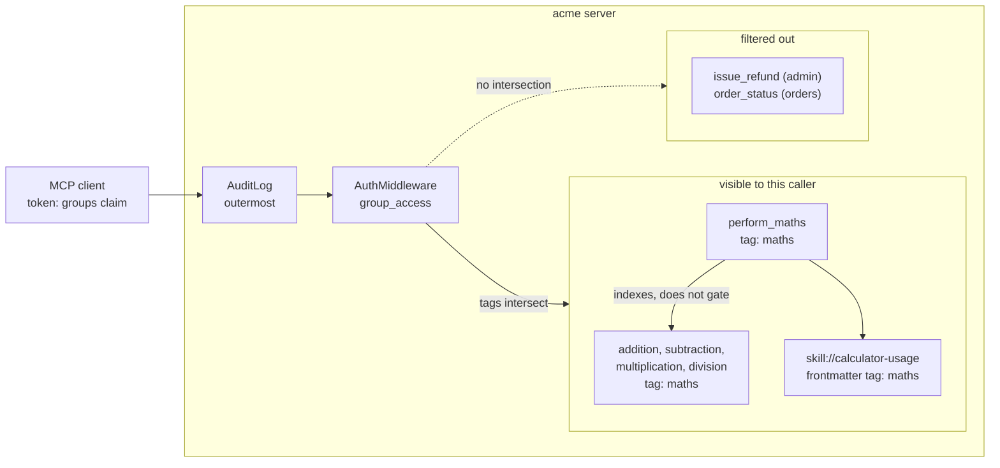
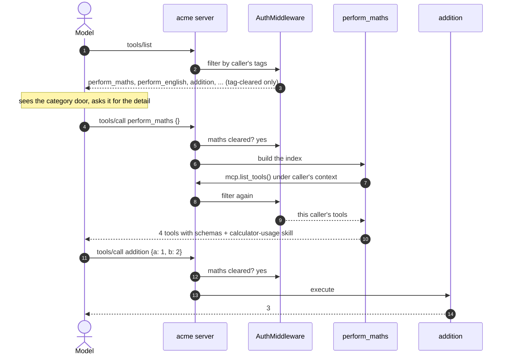

# Tool Grouping And Surfacing

A caller's tool list is context. Every tool the server lists gets read by the
model on every turn, whether or not it is relevant. An admin on this server
sees 17 tools; four of them are arithmetic. Dumping the lot into a listing is
how you end up paying for `subtraction`'s input schema in a conversation about
refunds.

So the server surfaces tools in two layers. Tags decide what a caller can see
at all. Category facades then act as a per-domain index, so a model can ask
"what maths can you do?" and get one answer instead of scanning names.

The two layers are independent. Tags are enforcement and run on every request.
Facades are discovery and only ever return what the tag layer already allowed.

## Layer One: Tags Decide What Exists

Every tool carries a domain tag at registration:

```python
@maths_server.tool(tags={"maths"})
def addition(a: int | float, b: int | float) -> int | float:
    """Add two numbers."""
    return a + b
```

`GROUP_TAGS` in `auth.py` maps each org group to the tags it may use, and
`group_access` in `access.py` intersects the caller's tags with the
component's:

```python
def group_access(ctx: AuthContext) -> bool:
    if ctx.token is None:
        return False
    allowed = tags_for_groups(ctx.token.claims.get("groups"))
    if ALL_TAGS in allowed:
        return True
    ...
    return bool(component_tags & allowed)
```

FastMCP's `AuthMiddleware` runs that check in both directions. It filters
denied components out of `tools/list`, and it blocks `tools/call` on a name the
caller guessed. Skills go through the same check, matched on their frontmatter
tags, so the same groups that can export a report can read the report handling
instructions.



The important detail is that the facade sits inside the allowed set, not in
front of it. It is a peer of the tools it lists, not a gate over them.

## Layer Two: A Facade Per Category

`_facade` in `server.py` registers a no-argument tool per category. It builds
its answer at call time from the server's own listings rather than a hardcoded
table:

```python
tools = [
    {"name": t.name, "description": t.description, "input_schema": t.parameters}
    for t in await mcp.list_tools()
    if tag in t.tags and t.name != name
]
```

That comprehension is the whole mechanism. `mcp.list_tools()` runs under the
caller's auth context, so it arrives already filtered by layer one. The tag comparison narrows it
to the category, and the name check keeps the facade out of its own answer.

Building from the live listing is what keeps the facade honest. Add a fifth
maths tool and the facade reports it on the next call, with no second place to
update and no chance of advertising something the caller cannot run. A static
list would drift, and a drifted facade is worse than none because a model
trusts it.

The response shape is `category`, `description`, `tools`, `skills`:

```json
{
  "category": "maths",
  "description": "List the available maths operations and companion skills.",
  "tools": [
    {
      "name": "addition",
      "description": "Add two numbers.",
      "input_schema": {"type": "object", "properties": {"a": {...}, "b": {...}},
                       "required": ["a", "b"]}
    }
  ],
  "skills": [
    {"name": "calculator-usage",
     "description": "...",
     "uri": "skill://calculator-usage/SKILL.md"}
  ]
}
```

Input schemas are included deliberately. A model that calls `perform_maths` has
everything it needs to call `addition` correctly on the very next turn, without
a round trip to look the signature up.

Skills are filtered the same way, minus the `_manifest` resources, which are
plumbing the model has no use for.

## The Discovery Path



Note the second filter pass at step 8. The facade does not get a privileged
view of the server. It sees exactly what the caller sees, which is why it
cannot name a tool the caller would then be denied.

## What A Caller Actually Sees

One limitation is worth stating plainly, because it is the bit people assume
wrong. The facade does not hide its members. Both appear in `tools/list`
together:

| Group | Tools listed |
| --- | --- |
| `engineering` (no grants) | `whoami` |
| `finance` | 13, including `perform_maths` **and** `addition`, `subtraction`, ... |
| `support` | 16 |
| `admin` | 17 |

So a facade currently buys discovery and grouping, not context reduction. A
model that wants the shape of a domain in one call gets it, but the individual
tools are still in the listing next to it.

Hiding members behind their facade is a small change - drop the category tag
from the members and give the facade a mount-time filter, or add a `hidden`
tag the access check strips from listings while still permitting calls. It is
not done here because the example server has 17 tools and the cost has not
started to bite. Do it when a domain gets big enough that the listing is the
problem, not before.

## Adding A Category

Three steps, no framework:

1. Tag the tools in a domain sub-server, for example `tags={"reports"}`.
2. Grant the tag to whichever groups need it in `GROUP_TAGS`.
3. Register the door in `build_server`:

```python
_facade(
    mcp,
    name="perform_reports",
    tag="reports",
    description="List the available reporting tools and companion skills.",
)
```

The facade inherits the tag, so it appears and disappears with the domain it
describes. A caller not cleared for `reports` never sees `perform_reports` and
cannot call it by name.

## Proving It

The behaviour above is covered by `tests/test_facades.py`, and the whole suite
runs offline with FastMCP's in-memory client:

```bash
python -m pytest -q
```

```
110 passed in 5.02s
```

The tests that matter for this doc:

| Test | Claim it locks down |
| --- | --- |
| `test_cleared_callers_see_both_facades` | facades are listed for support, finance and admin |
| `test_perform_maths_lists_only_maths_tools` | exactly the four maths tools, each with a usable input schema |
| `test_perform_english_lists_only_english_tools` | the same for English, so neither facade bleeds into the other |
| `test_uncleared_caller_cannot_see_or_call_facades` | an `engineering` caller gets neither the listing nor the call |
| `test_facade_named_tool_is_callable` | a name returned by the facade actually works |
| `test_facade_companion_skill_uri_is_readable` | the returned `skill://` URI resolves to real content |
| `test_facade_contents_are_scoped_to_the_caller` | a caller cleared for one category only sees that category inside the facade |

That last one is the one worth reading. It grants a synthetic group the `maths`
tag and nothing else, then checks the facade's answer against what the caller
can actually run. Without it, every real group holds both `maths` and
`english`, so a facade that ignored auth entirely and filtered on tags alone
would still pass every other test.

To see the layering by hand, list tools as each group against the in-memory
client:

```python
import asyncio
from fastmcp import Client
from acme_mcp.server import build_server
from tests.conftest import as_caller

async def main():
    mcp = build_server(env="dev")
    for groups in (["engineering"], ["finance"], ["support"], ["admin"]):
        with as_caller(groups=groups):
            async with Client(mcp) as c:
                print(groups, sorted(t.name for t in await c.list_tools()))

asyncio.run(main())
```

Which prints, at the time of writing:

```
['engineering'] ['whoami']
['finance'] ['addition', 'division', 'export_report', 'get_invoice',
             'multiplication', 'noun_count', 'perform_english', 'perform_maths',
             'subtraction', 'verb_count', 'vowel_count', 'whoami', 'word_count']
['support'] [... 16 tools ...]
['admin'] [... 17 tools ...]
```

The `engineering` row is the one to look at. No grants in `GROUP_TAGS` means no
domain tags, so the facades vanish along with everything they index.
