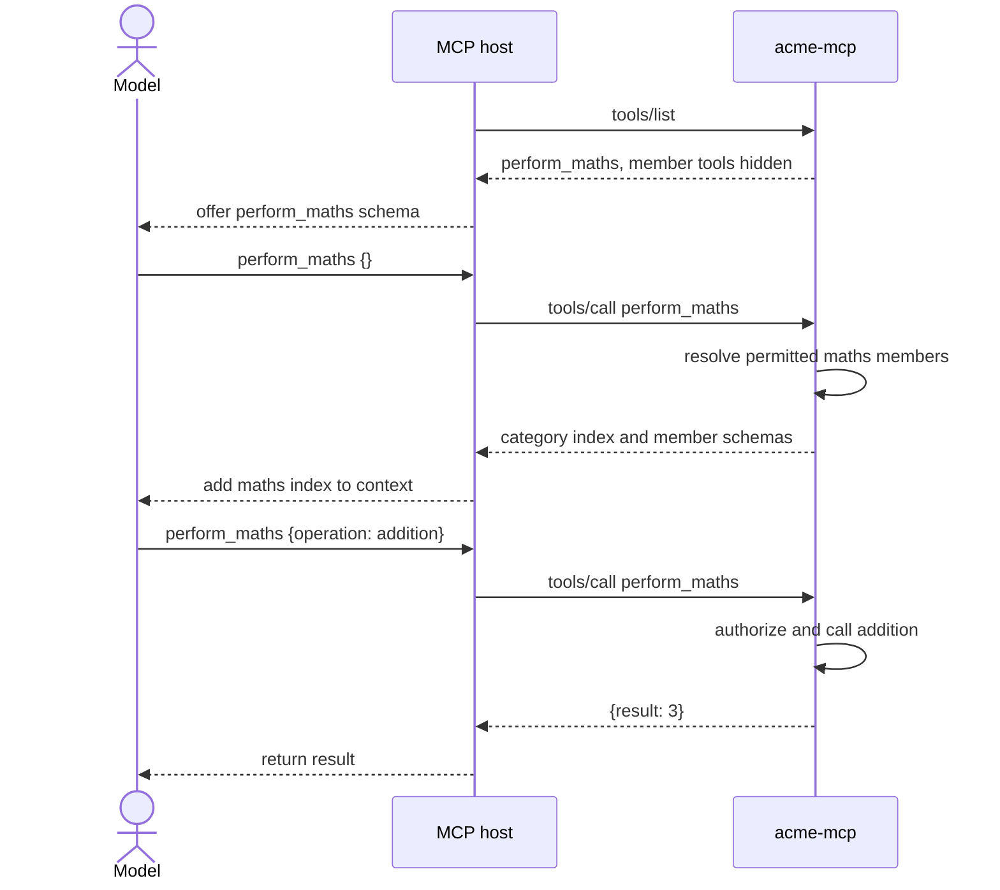

# Tool grouping and surfacing

## Summary

Tool grouping reduces the model context used by large MCP servers. An MCP host adds every definition from `tools/list` to the model's context, including tools that have nothing to do with the current request.

This server groups related tools behind category facades. A finance caller sees `perform_maths` in the top-level listing while `addition`, `division`, `multiplication`, and `subtraction` stay hidden. The facade supports two calls:

| Call | Purpose |
| --- | --- |
| `perform_maths {}` | Return the permitted maths operations, their input schemas, and related skills |
| `perform_maths {"operation": "addition", "arguments": {"a": 1, "b": 2}}` | Run `addition` through the normal server pipeline |

Authorization still applies to every facade and member. Grouping changes what the host offers the model. It does not grant any extra access.

Each facade replaces every member definition in its category with one top-level definition. The initial listing adds one definition per category, so member count no longer determines its size. Member schemas enter the conversation only after the model asks for that category.

## Example

A finance caller starts with this toolset:

```text
export_report
get_invoice
perform_english
perform_maths
whoami
```

The model calls `perform_maths` with no arguments and receives an index. This excerpt shows one of the four maths tools and omits some generated schema fields:

```json
{
  "category": "maths",
  "description": "List the available maths operations and companion skills.",
  "tools": [
    {
      "name": "addition",
      "description": "Add two numbers.",
      "input_schema": {
        "type": "object",
        "properties": {
          "a": {"anyOf": [{"type": "integer"}, {"type": "number"}]},
          "b": {"anyOf": [{"type": "integer"}, {"type": "number"}]}
        },
        "required": ["a", "b"]
      }
    }
  ],
  "skills": [
    {
      "name": "calculator-usage",
      "uri": "skill://calculator-usage/SKILL.md"
    }
  ]
}
```

The model then routes the operation through the same facade:

```json
{
  "operation": "addition",
  "arguments": {"a": 1, "b": 2}
}
```

The response keeps the category and operation in the result:

```json
{"category": "maths", "operation": "addition", "result": 3}
```

A direct `addition` call is unavailable to a normal host because `addition` did not appear in `tools/list`. The facade is the route to every hidden member.

This sequence shows when each schema enters the model's context and how a hidden member is called:



## Technical detail

### Why the listing controls model access

The server can accept a direct call to a permitted hidden tool, and FastMCP's in-memory `Client` can make that call by name. A real MCP host gives the model the definitions returned by `tools/list`. The model cannot emit a tool call for a definition the host never supplied.

Returning an input schema from `perform_maths` gives the model enough information to prepare arguments. That schema remains result data and does not register `addition` as a model-callable tool. The next call must still use `perform_maths`.

This distinction needs a host-shaped test. A test that calls `Client.call_tool("addition", ...)` only proves that the server will execute the name.

### Access filtering runs first

All domain tools and their facades carry a tag such as `maths` or `english`. `AuthMiddleware` filters the full listing using the caller's group grants. `HideFacadeMembers` receives that filtered list and removes the members of each visible facade.

`HideFacadeMembers` changes `tools/list` only:

```python
async def on_list_tools(self, context, call_next):
    tools = await call_next(context)
    if _listing_for_facade.get():
        return tools

    doors = {tool.name for tool in tools} & set(self.facades.values())
    hidden = {tag for tag, name in self.facades.items() if name in doors}
    return [
        tool
        for tool in tools
        if tool.name in doors or not (hidden & set(tool.tags))
    ]
```

Members stay listed when their facade is absent. This prevents the middleware from hiding an allowed tool without leaving the caller a route to it.

The current listing sizes show the effect:

| Group | Before grouping | After grouping |
| --- | ---: | ---: |
| `engineering` | 1 | 1 |
| `finance` | 13 | 5 |
| `support` | 16 | 8 |
| `admin` | 17 | 9 |

For finance, two facade definitions replace ten maths and English member definitions. The other three visible business tools stay unchanged.

### Facades discover their members at call time

`_facade` in `src/acme_mcp/server.py` builds its index from the server's current listing:

```python
with listing_for_facade():
    listed = await mcp.list_tools()

members = {
    tool.name: tool
    for tool in listed
    if tag in tool.tags and tool.name != name
}
```

This uses the caller's active auth context, so the index only contains tools the caller can use. The tag selects the category and the name check excludes the facade itself.

The facade reads live metadata rather than a separate member list. Adding a tagged tool updates the index on the next call and keeps its description and schema aligned with the registered tool.

`listing_for_facade()` temporarily disables member hiding while this internal listing runs. The access middleware stays active. Calling `mcp.list_tools(run_middleware=False)` would bypass access filtering as well, which would expose tools from other grants.

### Dispatch re-enters the middleware pipeline

When the request includes `operation`, the facade checks the caller-scoped `members` mapping and calls the selected tool:

```python
if operation is not None:
    if operation not in members:
        raise ToolError(f"Unknown {tag} operation: {operation}")
    result = await mcp.call_tool(operation, arguments or {})
```

The membership check rejects an unknown name, a tool from another category, and a tool filtered by authorization with the same category error. The facade cannot dispatch itself.

`mcp.call_tool` re-enters the normal middleware pipeline. FastMCP applies authorization to the member call and `AuditLog` records it.

### Skills use the same category

Each facade also lists skills whose frontmatter contains its category tag. It excludes provider manifest resources and returns the skill name, description, and `skill://` URI.

The caller can read a returned skill because the access middleware evaluates the same frontmatter tag. A category index therefore cannot advertise a skill that the caller is unable to read.

### Validation trade-offs

Facade arguments arrive as an untyped dictionary because the host only knows the facade's broad `arguments` field. The member tool validates its own signature after dispatch:

```text
perform_maths {"operation": "division", "arguments": {"a": 1}}
  1 validation error for call[division]
  b  Missing required argument
```

Member `ToolError` values also pass through. Division by zero still returns `division by zero`.

The host cannot validate a hidden member's input before sending the facade call, and it has no member output schema for client-side result validation. Server-side input validation and authorization still run.

Dynamic tool listing offers another design. A server can reveal members after the category is selected and send `notifications/tools/list_changed`. That keeps each member as a first-class tool, but it needs session state and host support for the notification. FastMCP 3.4 has no server-side helper for this flow, so this example uses facade dispatch.

### Adding a category

Tag each member tool:

```python
@reports_server.tool(tags={"reports"})
def export_report(...): ...
```

Grant the tag to the required groups in `GROUP_TAGS`, then register the facade in `build_server`:

```python
facades = {
    "reports": _facade(
        mcp,
        name="perform_reports",
        tag="reports",
        description="List the available reporting tools and companion skills.",
    ),
}
```

Pass that mapping to `HideFacadeMembers`. The facade receives the category tag, so callers without the grant cannot see or call it.

### Verification

Run the focused tests with the project virtual environment:

```bash
.venv/bin/python -m pytest -q tests/test_facades.py tests/test_maths.py tests/test_english.py
```

The most important cases are:

| Test | Behaviour |
| --- | --- |
| `test_a_model_reaches_hidden_members_only_through_the_facade` | Models can reach hidden members through a name present in their toolset |
| `test_facade_contents_are_scoped_to_the_caller` | The index uses the caller's grants |
| `test_facade_refuses_anything_outside_its_own_domain` | Cross-category and unknown operations share one failure path |
| `test_members_stay_listed_when_their_facade_is_not` | Hiding never strands an allowed member |

Run the complete suite before changing middleware order or facade dispatch:

```bash
.venv/bin/python -m pytest -q
```
